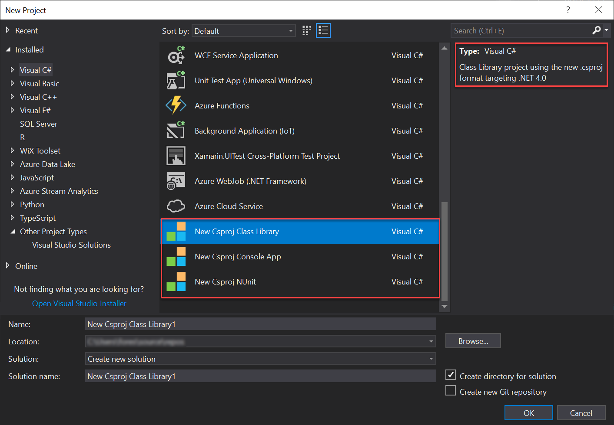

# new-csproj-templates<!-- omit in toc -->
Templates for new .csproj files, because Visual Studio doesn't support them by default, yet.

- [Usage](#usage)
- [Alternative(s)](#alternatives)
- [Reference](#reference)
  - [Project Type Examples](#project-type-examples)

# Usage

Download the templates in `~\templates\` and copy (import) them into your Visual Studio 2017 Project Templates folder -  `C:\Users\<user>\OneDrive\Documents\Visual Studio 2017\Templates\ProjectTemplates`.

When creating a new project, look for the project type.



# Alternative(s)

The following commands can serve as a substitute for the templates in this repository:

* `dotnet new classlib -n [name]`
* `dotnet new console -n [name]` 
* `dotnet new nunit -n [name]`

... though you still need to add the project reference to the solution manually, and update the target .NET Framework.

*Credit to Sean Manton for initially sharing this with me.*

# Reference

## Project Type Examples
Example 1, .NET Framework

```csproj
<Project Sdk="Microsoft.NET.Sdk">

  <PropertyGroup>
    <TargetFramework>net40</TargetFramework>
  </PropertyGroup>

</Project>

```

Example 2, .NET Standard

```csproj
<Project Sdk="Microsoft.NET.Sdk">

  <PropertyGroup>
    <TargetFramework>netstandard2.0</TargetFramework>
  </PropertyGroup>

</Project>

```

Example 3, .NET Framework *and* .NET Standard

```csproj
<Project Sdk="Microsoft.NET.Sdk">

  <PropertyGroup>
    <TargetFramework>net40;netstandard2.0</TargetFramework>
  </PropertyGroup>

</Project>

```

Example 4, .NET Core

```csproj
<Project Sdk="Microsoft.NET.Sdk">

  <PropertyGroup>
    <TargetFramework>netcoreapp2.0</TargetFramework>
  </PropertyGroup>

</Project>

```