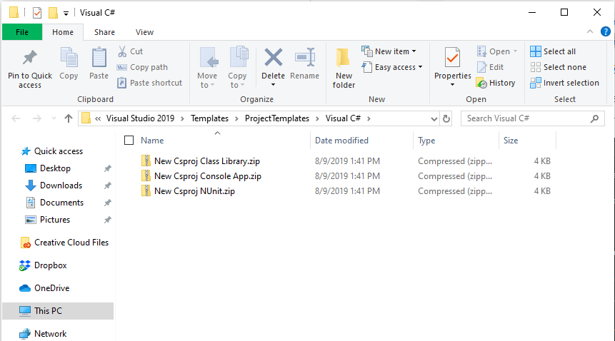
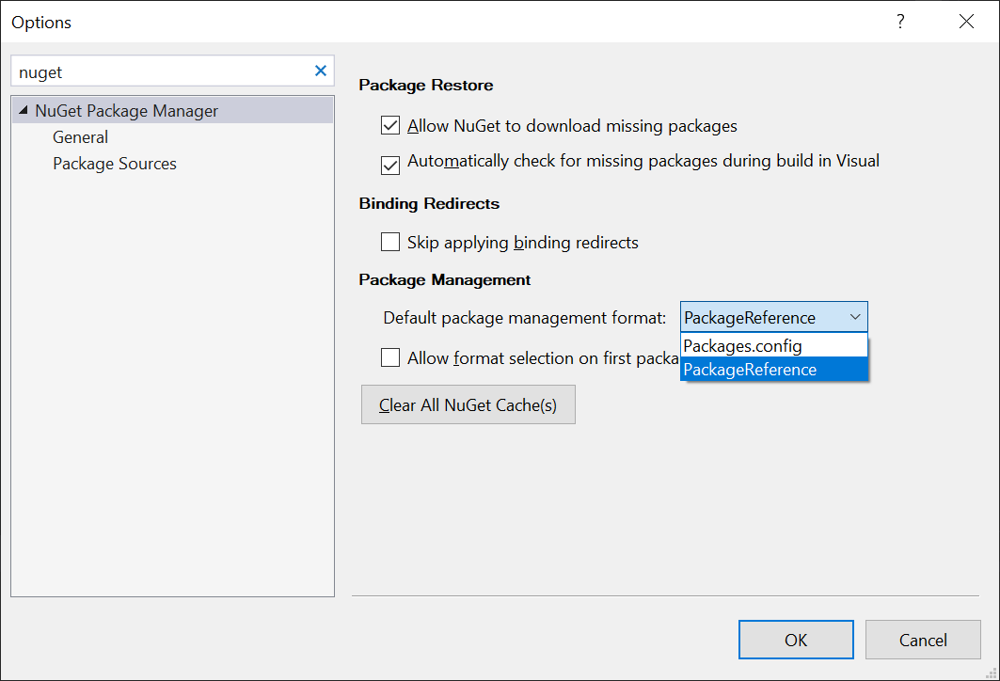

# new-csproj-templates<!-- omit in toc -->
Templates for new .csproj files, because Visual Studio doesn't support them by default, yet.

- [Usage](#usage)
  - [Download](#download)
  - [Use](#use)
- [Alternative(s)](#alternatives)
- [Reference](#reference)
  - [Project Type Examples](#project-type-examples)

# Usage

## Download

1. Download the templates in `~\templates\` (or clone this repository)
2. Copy the `.zip` files into your Visual Studio 2017/2019 Project Templates folder, found at...

- `%USERPROFILE%\Documents\Visual Studio 2017\Templates\ProjectTemplates\Visual C#`
- `%USERPROFILE%\Documents\Visual Studio 2019\Templates\ProjectTemplates\Visual C#`


*Note: do not unzip them - simply place the `.zip` files in that directory.*



## Use 
When creating a new project, look for the project type.


... and don't forget to tell Visual Studio *not* to use `packages.config` by default anymore.

`Tools` -> `Options` -> `NuGet Package Manager`



# Alternative(s)

The following commands can serve as a substitute for the templates in this repository:

* `dotnet new classlib -n [name]`
* `dotnet new console -n [name]` 
* `dotnet new nunit -n [name]`

... though you still need to add the project reference to the solution manually, and update the target .NET Framework.

*Credit to Sean Manton for initially sharing this with me.*

# Reference

## Project Type Examples
Example 1, .NET Framework

```csproj
<Project Sdk="Microsoft.NET.Sdk">

  <PropertyGroup>
    <TargetFramework>net40</TargetFramework>
  </PropertyGroup>

</Project>

```

Example 2, .NET Standard

```csproj
<Project Sdk="Microsoft.NET.Sdk">

  <PropertyGroup>
    <TargetFramework>netstandard2.0</TargetFramework>
  </PropertyGroup>

</Project>

```

Example 3, .NET Framework *and* .NET Standard

```csproj
<Project Sdk="Microsoft.NET.Sdk">

  <PropertyGroup>
    <TargetFramework>net40;netstandard2.0</TargetFramework>
  </PropertyGroup>

</Project>

```

Example 4, .NET Core

```csproj
<Project Sdk="Microsoft.NET.Sdk">

  <PropertyGroup>
    <TargetFramework>netcoreapp2.0</TargetFramework>
  </PropertyGroup>

</Project>

```